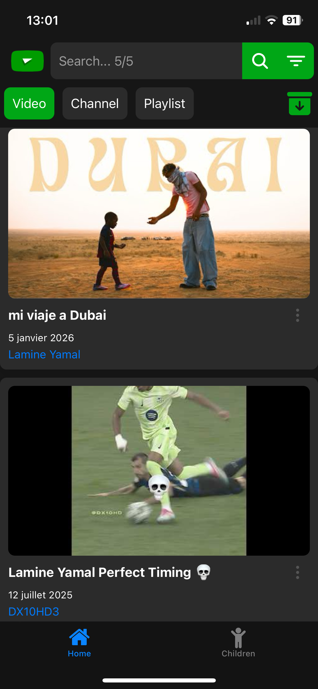
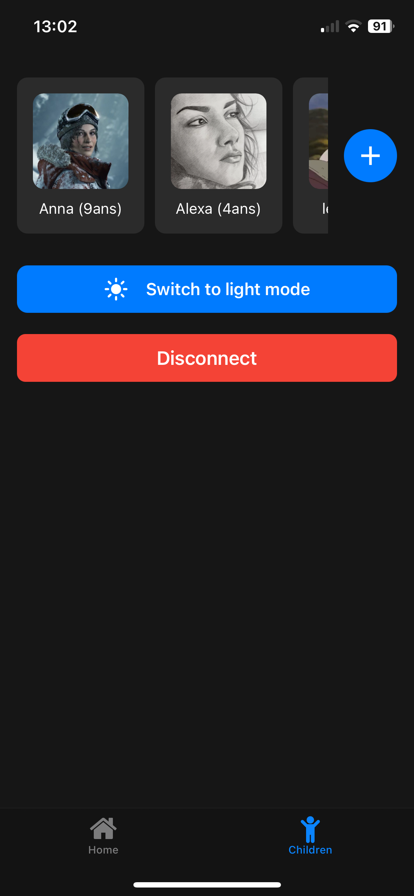
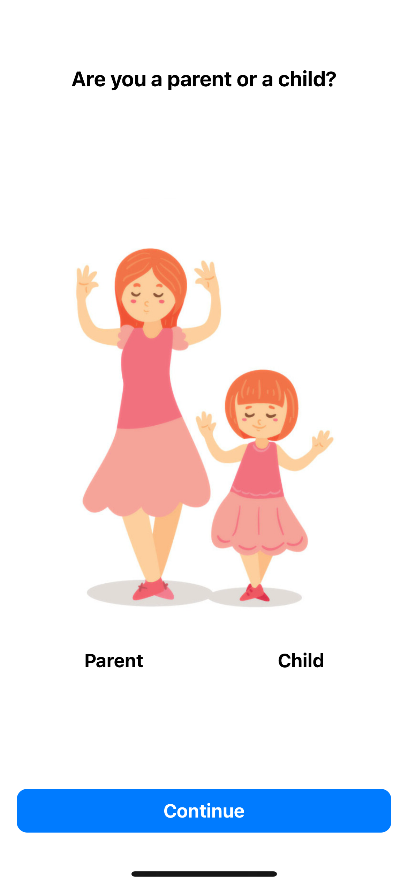
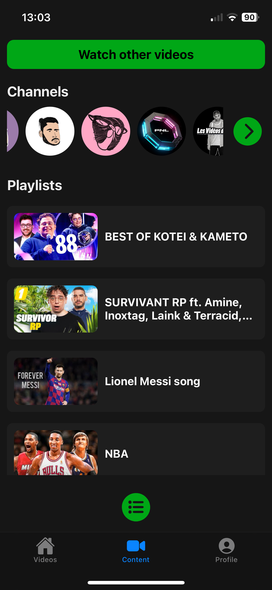
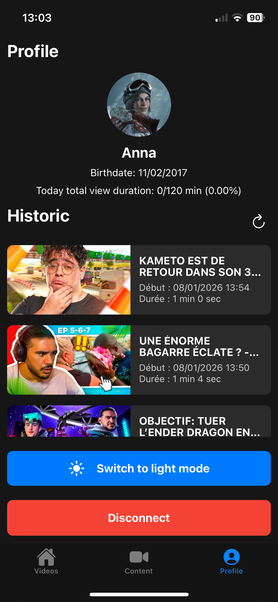
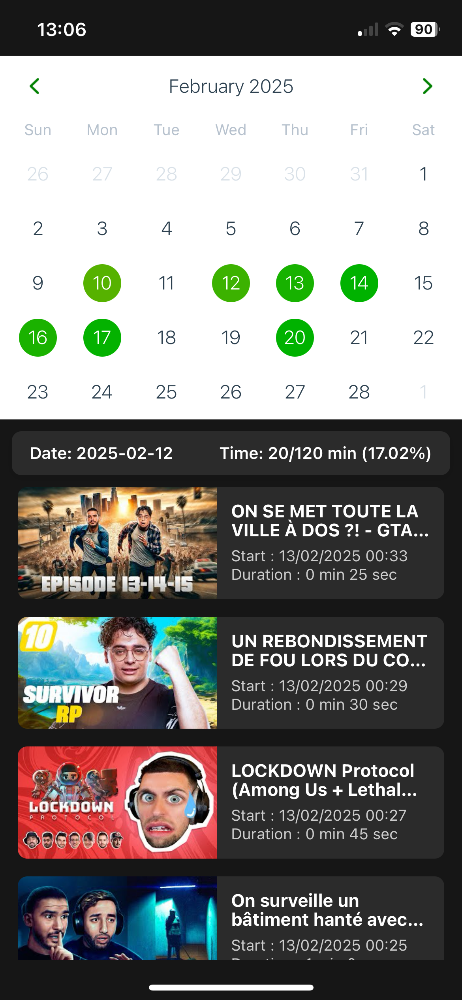
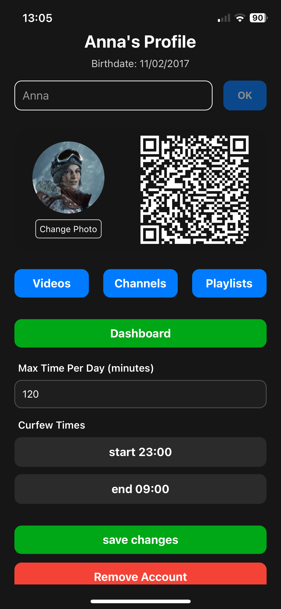

# safetube-showcase
# SafeTube 🎬👨‍👩‍👧

Note : Ceci est un dépôt vitrine. Le code source complet est hébergé sur un dépôt privé pour des raisons de confidentialité

Une application mobile de contrôle parental innovante pour YouTube, construite avec **React Native** et **Expo**. SafeTube 2.0 permet aux parents de surveiller et de gérer le temps d'écran de leurs enfants tout en offrant un environnement de visionnage sécurisé.

## 🎯 Vue d'ensemble du projet


## 📱 Aperçu de l'application

<p align="center">
  &nbsp;&nbsp;&nbsp;&nbsp;&nbsp;&nbsp;
  
</p>

<br><br>

<p align="center">
  &nbsp;&nbsp;&nbsp;&nbsp;&nbsp;&nbsp;
  
</p>

<br><br>

<p align="center">
  &nbsp;&nbsp;&nbsp;&nbsp;&nbsp;&nbsp;
  
</p>

<br><br>

<p align="center">
  &nbsp;&nbsp;&nbsp;&nbsp;&nbsp;&nbsp;
  
</p>

<br><br>

<p align="center">
  &nbsp;&nbsp;&nbsp;&nbsp;&nbsp;&nbsp;
</p>


SafeTube 2.0 est une plateforme complète de gestion parentale YouTube avec deux interfaces distinctes :
- **Interface Parent** : gestion des profils, restrictions et surveillance
- **Interface Enfant** : feed vidéo sécurisé avec historique de visionnage

## 📱 Technologie utilisée

### Stack Frontend
- **React Native** (v0.86.3) - Framework mobile cross-platform
- **Expo** (v57.0.25) - Plateforme de développement React Native
- **Expo Router** (v57.0.23) - Navigation basée sur fichiers
- **TypeScript** (v6.0.3) - Typage statique

### Composants clés
- **expo-router** - Navigation en onglets et en piles
- **@react-navigation** - Gestion de navigation avancée
- **expo-camera** - Accès à la caméra pour les QR codes
- **expo-sqlite** - Base de données locale
- **@react-native-async-storage** - Stockage persistant
- **axios** - Requêtes HTTP
- **react-native-qrcode-svg** - Génération de QR codes
- **react-native-youtube-iframe** - Lecteur YouTube intégré

## 🏗️ Architecture de l'application

```
app/
├── (tabs)/                 # Navigation par onglets
│   ├── index.tsx          # Écran d'accueil
│   ├── explore.tsx        # Écran d'exploration
│   └── _layout.tsx        # Configuration des onglets
├── (auth)/                # Écrans d'authentification
│   ├── login.tsx          # Connexion parent
│   ├── signup.tsx         # Inscription parent
│   ├── childLogin.tsx     # Connexion enfant (QR code)
│   └── _layout.tsx        # Configuration auth
├── (main)/                # Écrans principaux
│   ├── (parent)/          # Routes parent
│   ├── (child)/           # Routes enfant
│   ├── videoPlayer.tsx    # Lecteur vidéo
│   ├── channelProfile.tsx # Profil de chaîne
│   ├── playlistProfile.tsx # Profil de playlist
│   └── lists/             # Listes et grilles
├── services/              # Services API
│   ├── childAPI/          # API enfant
│   ├── parentAPI/         # API parent
│   ├── sharedAPI/         # API partagée
│   ├── config.ts          # Configuration API
│   ├── RequestGateway.ts  # Passerelle de requêtes
│   └── RouterService.ts   # Service de navigation
├── data/                  # Services de données
│   └── dataService.ts     # Gestion base de données
├── types.ts               # Interfaces TypeScript
└── index.tsx              # Point d'entrée App
```

## ✨ Fonctionnalités principales

### 1. **Authentification et Rôles** 👤
- **Mode Parent** :
  - Inscription et connexion sécurisées
  - Gestion de plusieurs profils enfants
  - Création de restrictions personnalisées
  
- **Mode Enfant** :
  - Connexion par QR code (généré par le parent)
  - Accès sécurisé au compte enfant
  - Interface simplifiée et adaptée

### 2. **Gestion des Profils Enfants** 👶
- Création et gestion de profils multiples
- Définition de la date de naissance
- Photo/avatar personnalisé
- Profils stockés localement et synchronisés avec le serveur

### 3. **Système de Restrictions Parentales** 🛡️
- **Limite de temps quotidienne** : configurable par profil
- **Couvre-feu** : plages horaires autorisées pour le visionnage
- **Fin de couvre-feu** : heure de fin de la période d'accès
- Application en temps réel des restrictions

### 4. **Feed Vidéo Personnalisé** 📹
- Récupération de vidéos à partir des préférences de l'enfant
- Filtrage de contenu selon les restrictions
- **Actualisation du feed** : obtenir de nouvelles vidéos
- **Chargement infini** : charger plus de vidéos à la demande
- Interface de découverte engageante

### 5. **Historique de Visionnage** 📊
- Enregistrement automatique des vidéos regardées
- Suivi du temps de visionnage par vidéo
- Synchronisation locale/serveur
- Consultation de l'historique récent

### 6. **Gestion des Chaînes et Playlists** 📚
- Affichage des profils de chaîne complètement
- Accès aux playlists des créateurs
- Métadonnées enrichies (titre, description, miniatures)

### 7. **Lecteur Vidéo Intégré** ▶️
- Lecteur YouTube natif via WebView
- Suivi du temps de visionnage
- Contrôles standard (pause, play, volume)

### 8. **Gestion des Données Locales** 💾
- Base de données **SQLite** pour le stockage hors ligne
- **AsyncStorage** pour les données sensibles (tokens, préférences)
- Synchronisation bidirectionnelle serveur/client
- Cache intelligente des vidéos et métadonnées

## 🔐 Sécurité et Authentification

### Gestion des Tokens
- Authentification par **Bearer Token**
- Stockage sécurisé dans AsyncStorage
- **Refresh Token** automatique à l'expiration
- Déconnexion en cas d'erreur 403

### Passerelle de Requêtes (RequestGateway)
- Centralisée pour toutes les requêtes HTTP
- Injection automatique des tokens d'authentification
- Gestion des erreurs unifiée
- Réessais automatiques en cas d'échec

## 📡 Intégration API

### Endpoints Parent
```typescript
POST   /signup                              // Inscription
POST   /login                               // Connexion
GET    /get-all-children                    // Récupérer tous les enfants
GET    /get-child-profile-for-parent/:id    // Profil enfant pour parent
```

### Endpoints Enfant
```typescript
GET    /child-login/:qrCodeData             // Connexion par QR
GET    /get-child-profile                   // Récupérer profil enfant
POST   /get-more-video-feed                 // Charger plus de vidéos
GET    /refresh-video-feed                  // Actualiser le feed
POST   /save-historic-stats                 // Sauvegarder historique
GET    /get-recent-historic                 // Récupérer historique récent
```

### Configuration API
- **Base URL** : `https://mern-safetube-server.onrender.com/api`
- Configurable via `app/services/config.ts`
- Support du développement local

## 🎨 Interface Utilisateur

### Composants Réutilisables
- **ThemedText** - Texte avec thème adaptatif
- **ThemedView** - Conteneur avec thème adaptatif
- **HapticTab** - Onglets avec retour haptique
- **ParallaxScrollView** - ScrollView parallaxe
- **Collapsible** - Sections repliables
- **SafeImage** - Images avec gestion d'erreurs

### Système de Thème
- Support du **mode clair/sombre** automatique
- Couleurs personnalisables par thème
- Thème adaptatif iOS/Android

## 📦 Dépendances principales

```json
{
  "react": "19.2.3",
  "react-native": "0.86.3",
  "expo": "~57.0.25",
  "expo-router": "~57.0.23",
  "expo-camera": "~57.0.5",
  "expo-sqlite": "~57.0.3",
  "@react-native-async-storage/async-storage": "^2.2.0",
  "axios": "^1.13.2",
  "react-native-qrcode-svg": "^6.3.21",
  "react-native-youtube-iframe": "^2.4.1"
}
```

## 🚀 Installation et Setup

### Prérequis
- Node.js (v20.19.4+, v22.13.0+ ou v24.3.0+)
- npm ou pnpm
- Expo CLI (`npm install -g expo-cli`)

### Installation
```bash
# Installer les dépendances
npm install
# ou
pnpm install

# Initialiser la base de données
npm run reset-project
```

### Développement

**Lancer l'application en développement** :
```bash
npm start
```

**Ouvrir sur Android** :
```bash
npm run android
```

**Ouvrir sur iOS** :
```bash
npm run ios
```

**Ouvrir sur le web** :
```bash
npm run web
```

### Linting
```bash
npm run lint
```

## 📱 Plateformes supportées
- ✅ **iOS** (iPad & iPhone)
- ✅ **Android** (téléphones et tablettes)
- ✅ **Web** (version statique)

## 🔧 Configuration

### Variables d'environnement API
Modifier [config.ts](app/services/config.ts) :

```typescript
export const API_CONFIG = {
  baseURL: 'https://mern-safetube-server.onrender.com/api',
};
```

### Activation des fonctionnalités expérimentales
Configurées dans `app.json` :
- **typedRoutes** : Routes typées avec Expo Router
- **reactCompiler** : Compilateur React expérimental

## 📊 Types de données principaux

### Video
```typescript
{
  videoId: string;
  title: string;
  description: string;
  channelTitle: string;
  channelId: string;
  publishedAt: string;
  thumbnails: { default, medium, high };
}
```

### Child
```typescript
{
  _id: string;
  name: string;
  birthDate: string;
  url: string;
  restrictions: {
    maxTimePerDay: number;
    curfew: string;
    curfewEnd: string;
  };
  historic: Historic[];
  videos: Video[];
}
```

### Historic
```typescript
{
  video: Video;
  startTime: string;
  viewDuration: number;
  endTime: string;
}
```

## 🎯 Flux utilisateur

### Pour les parents
1. ✅ S'inscrire / Se connecter
2. ✅ Créer un profil enfant
3. ✅ Générer un QR code de connexion
4. ✅ Configurer les restrictions (temps limite, couvre-feu)
5. ✅ Consulter l'historique de visionnage
6. ✅ Gérer les chaînes et playlists autorisées

### Pour les enfants
1. ✅ Scanner le QR code parent
2. ✅ Accéder au feed vidéo personnalisé
3. ✅ Regarder des vidéos (avec restrictions)
4. ✅ Explorer des chaînes et playlists
5. ✅ Découvrir de nouvelles vidéos
6. ✅ L'historique est automatiquement enregistré

## 🔄 Synchronisation des données

- **Stockage local** : SQLite pour les données volumineuses
- **AsyncStorage** : Tokens et préférences utilisateur
- **Sync serveur** : Historique et profils
- **Gestion hors ligne** : Accès aux données en cache
- **Actualisation automatique** : Vérification des mises à jour

## 🐛 Debugging et Logs

L'application inclut des logs détaillés pour :
- Authentification et tokens
- Requêtes API
- Gestion des erreurs
- États de l'application

Consultez la console Expo pour les détails.

## 📄 Licence

Ce projet est privé et réservé.

## 👥 Auteur

Projet personnel SafeTube 2.0

---


## 💡 Notes de développement

- L'application utilise **Expo Go** pour le développement rapide
- Architecture **API-first** avec backend Node.js/Express
- Support complet du **TypeScript** pour la sécurité des types
- Thème **adaptatif** basé sur les préférences système
- Accessibilité mobile prioritaire

## 🎓 Ressources

- [Expo Documentation](https://docs.expo.dev/)
- [React Native Documentation](https://reactnative.dev/)
- [Expo Router Guide](https://docs.expo.dev/router/introduction/)
- [YouTube API Documentation](https://developers.google.com/youtube)
